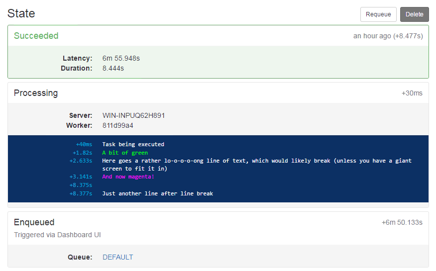
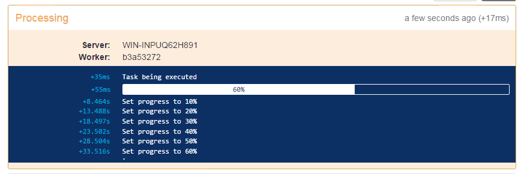

# Hangfire.Console


[](https://www.nuget.org/packages/Hangfire.Console/)

Inspired by AppVeyor, Hangfire.Console provides a console-like logging experience for your jobs. 



## Features

 - **Provider-agnostic**: (allegedly) works with any job storage provider (currently tested with SqlServer and MongoDB). 
 - **100% Safe**: no Hangfire-managed data (e.g. jobs, states) is ever updated, hence there's no risk to corrupt it.
 - **With Live Updates**: new messages will appear as they're logged, as if you're looking at real console.
 - (blah-blah-blah)

## Setup

In .NET Core's Startup.cs:
```c#
public void ConfigureServices(IServiceCollection services)
{
    services.AddHangfire(config =>
    {
        config.UseSqlServerStorage("connectionSting");
        config.UseConsole();
    });
}
```

Otherwise,
```c#
GlobalConfiguration.Configuration
    .UseSqlServerStorage("connectionSting")
    .UseConsole();
```

**NOTE**: If you have Dashboard and Server running separately, 
you'll need to call `UseConsole()` on both.

### Additional options

As usual, you may provide additional options for `UseConsole()` method.

Here's what you can configure:
- **ExpireIn** – time to keep console sessions (default: 24 hours)
- **PollInterval** – poll interval for live updates, ms (default: 1000)
- **BackgroundColor** – console background color (default: #0d3163)
- **TextColor** – console default text color (default: #ffffff)
- **TimestampColor** – timestamp text color (default: #00aad7)

## Log

Hangfire.Console provides extension methods on `PerformContext` object, 
hence you'll need to add it as a job argument. 

Now you can write to console:

```c#
public void TaskMethod(PerformContext context)
{
    context.WriteLine("Hello, world!");
}
```

Like with `System.Console`, you can specify text color for your messages:

```c#
public void TaskMethod(PerformContext context)
{
    context.SetTextColor(ConsoleTextColor.Red);
    context.WriteLine("Error!");
    context.ResetTextColor();
}
```

## Progress bars

Version 1.1.0 adds support for inline progress bars:



```c#
public void TaskMethod(PerformContext context)
{
    // create progress bar
    var progress = context.WriteProgressBar();
    
    // update value for previously created progress bar
    progress.SetValue(100);
}
```

You can create multiple progress bars and update them separately.

By default, progress bar is initialized with value `0`. You can specify initial value and progress bar color as optional arguments for `WriteProgressBar()`.
